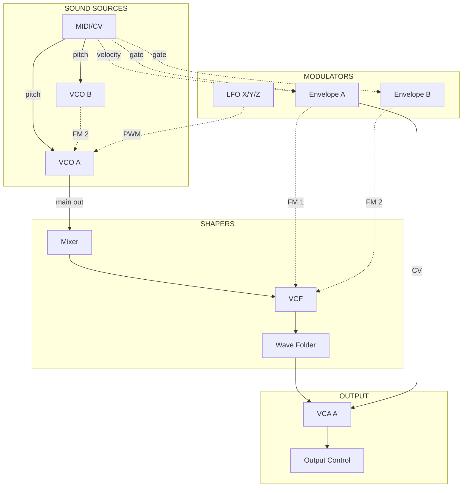

<objective>
Author all Cascadia instrument documentation: rewrite the overview page, create the normalled signal path with Mermaid diagram, write the module index, and create all 17 individual module documentation files.

Purpose: This is the core content deliverable of Phase 8 -- making the Cascadia's architecture, signal path, and every module's controls/jacks/normals browsable in the app.

Output: 20 markdown files (1 overview rewrite, 1 signal-flow, 1 modules index, 17 module files) in both `instruments/cascadia/` (vault source) and `src/content/instruments/cascadia/` (bundled content).
</objective>

<execution_context>
@$HOME/.claude/get-shit-done/workflows/execute-plan.md
@$HOME/.claude/get-shit-done/templates/summary.md
</execution_context>

<context>
@.planning/PROJECT.md
@.planning/ROADMAP.md
@.planning/STATE.md
@.planning/phases/08-cascadia-instrument-data/08-CONTEXT.md
@.planning/phases/08-cascadia-instrument-data/08-RESEARCH.md
@.planning/phases/08-cascadia-instrument-data/08-01-SUMMARY.md

<interfaces>
<!-- Schema contract from Plan 01 -->

From src/lib/content/schemas.ts (after Plan 01):
```typescript
export const InstrumentFileSchema = z.object({
  type: z.enum(['overview', 'signal-flow', 'basic-patch', 'modules', 'module']),
  instrument: z.string(),
  title: z.string(),
  manufacturer: z.string(),
  category: z.enum(['sound-source', 'shaper', 'modulator', 'utility']).optional(),
  control_count: z.number().int().nonnegative().optional(),
  jack_count: z.number().int().nonnegative().optional(),
  has_normals: z.boolean().optional(),
}).passthrough();
```

Module frontmatter template:
```yaml
---
type: module
instrument: cascadia
title: "{Module Name}"
manufacturer: "Intellijel"
category: sound-source | shaper | modulator | utility
control_count: {number}
jack_count: {number}
has_normals: true | false
---
```

Evolver overview pattern (for reference, NOT to mirror -- Cascadia uses different structure):
```yaml
---
type: overview
instrument: evolver
title: "Evolver Architecture Overview"
manufacturer: "Dave Smith Instruments"
---
```
</interfaces>
</context>

<tasks>

<task type="auto">
  <name>Task 1: Write overview, signal-flow, and modules index</name>
  <files>
    instruments/cascadia/overview.md,
    instruments/cascadia/signal-flow.md,
    instruments/cascadia/modules.md,
    src/content/instruments/cascadia/overview.md,
    src/content/instruments/cascadia/signal-flow.md,
    src/content/instruments/cascadia/modules.md
  </files>
  <read_first>
    - src/content/instruments/cascadia/overview.md
    - src/content/instruments/evolver/overview.md
    - src/content/instruments/evolver/signal-flow.md
    - src/content/instruments/evolver/modules.md
    - src/content/references/cascadia_manual_v1.1.pdf (pages 1-16 for overview/quick-start, then pages 7-10 for signal flow/normalling)
    - .planning/phases/08-cascadia-instrument-data/08-CONTEXT.md
    - .planning/phases/08-cascadia-instrument-data/08-RESEARCH.md
  </read_first>
  <action>
**overview.md** -- Replace the placeholder content. Keep the existing frontmatter format (`type: overview`, `instrument: cascadia`, `title: "Intellijel Cascadia"`, `manufacturer: "Intellijel"`). Write the following sections per the CONTEXT.md locked structure:

1. **Identity** -- Manufacturer: Intellijel, Type: Semi-modular analog synthesizer, Format: Desktop/Eurorack-compatible, Year: 2022, Patch Points: 90+, Modules: 17 hardware modules
2. **Design Philosophy** -- West coast synthesis heritage (Buchla-inspired waveshaping/folding), semi-modular with extensive normalling, "instrument that plays with zero cables but rewards patching", normalling philosophy (every important connection pre-wired, patching overrides)
3. **Panel Layout** -- Left to right: MIDI/CV, VCO A, VCO B, Envelope A, Envelope B, Line In, Mixer, VCF, Wave Folder, VCA A, Push Gate, Utilities (S&H, Slew, Mixuverter), LFO X/Y/Z, Patchbay, VCA B/LPF, FX Send/Return, Output Control
4. **Normalling Overview** -- Brief explanation: normalling means modules are pre-connected internally. Playing a MIDI note produces a complete voice (oscillator -> filter -> amp -> output) with no cables. Patching a cable into a normalled input breaks that connection and substitutes your signal. This lets Cascadia work as both a self-contained synth and a modular patch canvas.
5. **What You Can Do With It** -- West coast timbres (waveshaping, wave folding, FM), east coast subtractive (VCF with resonance), complex modulation (triple-mode Envelope B, 3 LFOs), effects processing (external audio in, FX loop), self-patching for generative/evolving sounds
6. **Make a Sound** -- Condensed quick-start based on manual pp. 11-16: (a) Connect MIDI keyboard and headphones/speakers, (b) Turn on -- you hear VCO A through the normalled path, (c) Play notes -- pitch tracks via MIDI, (d) Turn up VCO A PWM knob to hear pulse width change, (e) Turn up Mixer SUB knob for sub-oscillator, (f) Sweep VCF CUTOFF to hear the filter, (g) Adjust Envelope A SUSTAIN and DECAY to shape the note. Note: "This is just orientation -- the full walkthrough is in the curriculum Module 1."

Add a link to signal flow: `[View full signal flow diagram](/instruments/cascadia/signal-flow)`
Add a link to modules: `[Explore all modules](/instruments/cascadia/modules)`

**signal-flow.md** -- Create new file with frontmatter `type: signal-flow`, `instrument: cascadia`, `title: "Cascadia Signal Flow"`, `manufacturer: "Intellijel"`. Content:

1. Intro paragraph using the copy from UI-SPEC: "With no cables patched, the Cascadia produces sound through these normalled connections:"
2. Mermaid diagram using subgraph syntax with 4 groups. Use the diagram from RESEARCH.md as the starting point but expand it to include ALL normalled connections from the research's "Normalled Signal Path" section:



Use solid arrows (`-->`) for the primary audio signal path (VCOA -> Mixer -> VCF -> WF -> VCA A -> Output). Use dashed arrows (`-.->`) for modulation normalling and secondary connections. This matches the CONTEXT.md decision.

3. After the diagram, write a prose section "What Each Connection Does" explaining each normalled connection: what it controls and what happens when you patch a cable into that input (breaks the normal, substitutes your signal). Cover all 11 connections from the RESEARCH.md normalled signal path list.

**modules.md** -- Create new file with frontmatter `type: modules`, `instrument: cascadia`, `title: "Cascadia Modules"`, `manufacturer: "Intellijel"`. Content: heading "Cascadia Hardware Modules", brief intro ("17 modules arranged left to right on the panel"), then a numbered list of all 17 modules in panel order with links to individual module pages using wikilink-style or standard markdown links. Group by category with headers:

- **Sound Sources**: MIDI/CV (links to /instruments/cascadia/modules/midi-cv), VCO A, VCO B
- **Modulators**: Envelope A, Envelope B, LFO X/Y/Z
- **Shapers**: Mixer, VCF, Wave Folder, VCA B/LPF
- **Utilities**: Line In, VCA A, Push Gate, Utilities (S&H/Slew/Mixuverter), Patchbay, FX Send/Return, Output Control

Each entry: module name as link + one-line description + control/jack counts.

**IMPORTANT**: Write files to BOTH `instruments/cascadia/` (vault source) and `src/content/instruments/cascadia/` (bundled). Files should be identical. Create the `instruments/cascadia/` directory if it doesn't exist.
  </action>
  <verify>
    <automated>npx vitest run src/lib/content/__tests__/schemas.test.ts --reporter=verbose && npx vitest run src/lib/content/__tests__/reader.test.ts --reporter=verbose</automated>
  </verify>
  <acceptance_criteria>
    - src/content/instruments/cascadia/overview.md contains `## Design Philosophy`
    - src/content/instruments/cascadia/overview.md contains `## Panel Layout`
    - src/content/instruments/cascadia/overview.md contains `## Make a Sound`
    - src/content/instruments/cascadia/overview.md contains `## Normalling Overview`
    - src/content/instruments/cascadia/overview.md contains link text `signal-flow`
    - src/content/instruments/cascadia/signal-flow.md contains `type: signal-flow`
    - src/content/instruments/cascadia/signal-flow.md contains triple-backtick mermaid block
    - src/content/instruments/cascadia/signal-flow.md contains `subgraph SOURCES`
    - src/content/instruments/cascadia/signal-flow.md contains `subgraph SHAPERS`
    - src/content/instruments/cascadia/signal-flow.md contains `subgraph MODULATORS`
    - src/content/instruments/cascadia/signal-flow.md contains `subgraph OUTPUT`
    - src/content/instruments/cascadia/modules.md contains `type: modules`
    - src/content/instruments/cascadia/modules.md contains `VCO A`
    - src/content/instruments/cascadia/modules.md contains `Output Control`
    - instruments/cascadia/overview.md exists and matches src/content version
    - instruments/cascadia/signal-flow.md exists and matches src/content version
    - All existing tests still pass
  </acceptance_criteria>
  <done>Overview page rewritten with Cascadia-specific 6-section structure. Signal flow page has Mermaid subgraph diagram with normalled connections and prose explanations. Module index lists all 17 modules in panel order grouped by category. All files exist in both vault source and bundled content locations.</done>
</task>

<task type="auto">
  <name>Task 2: Write all 17 module documentation files</name>
  <files>
    instruments/cascadia/modules/midi-cv.md,
    instruments/cascadia/modules/vco-a.md,
    instruments/cascadia/modules/vco-b.md,
    instruments/cascadia/modules/envelope-a.md,
    instruments/cascadia/modules/envelope-b.md,
    instruments/cascadia/modules/line-in.md,
    instruments/cascadia/modules/mixer.md,
    instruments/cascadia/modules/vcf.md,
    instruments/cascadia/modules/wave-folder.md,
    instruments/cascadia/modules/vca-a.md,
    instruments/cascadia/modules/push-gate.md,
    instruments/cascadia/modules/utilities.md,
    instruments/cascadia/modules/lfo-xyz.md,
    instruments/cascadia/modules/patchbay.md,
    instruments/cascadia/modules/vca-b-lpf.md,
    instruments/cascadia/modules/fx-send-return.md,
    instruments/cascadia/modules/output-control.md,
    src/content/instruments/cascadia/modules/midi-cv.md,
    src/content/instruments/cascadia/modules/vco-a.md,
    src/content/instruments/cascadia/modules/vco-b.md,
    src/content/instruments/cascadia/modules/envelope-a.md,
    src/content/instruments/cascadia/modules/envelope-b.md,
    src/content/instruments/cascadia/modules/line-in.md,
    src/content/instruments/cascadia/modules/mixer.md,
    src/content/instruments/cascadia/modules/vcf.md,
    src/content/instruments/cascadia/modules/wave-folder.md,
    src/content/instruments/cascadia/modules/vca-a.md,
    src/content/instruments/cascadia/modules/push-gate.md,
    src/content/instruments/cascadia/modules/utilities.md,
    src/content/instruments/cascadia/modules/lfo-xyz.md,
    src/content/instruments/cascadia/modules/patchbay.md,
    src/content/instruments/cascadia/modules/vca-b-lpf.md,
    src/content/instruments/cascadia/modules/fx-send-return.md,
    src/content/instruments/cascadia/modules/output-control.md
  </files>
  <read_first>
    - src/content/references/cascadia_manual_v1.1.pdf (pages 17-75 for all module specifications)
    - .planning/phases/08-cascadia-instrument-data/08-CONTEXT.md
    - .planning/phases/08-cascadia-instrument-data/08-RESEARCH.md
  </read_first>
  <action>
Create all 17 module files. Each file MUST follow this exact template structure (per CONTEXT.md locked decision):

```markdown
---
type: module
instrument: cascadia
title: "{Module Name}"
manufacturer: "Intellijel"
category: {sound-source|shaper|modulator|utility}
control_count: {exact count of knobs + switches + buttons}
jack_count: {exact count of input + output jacks}
has_normals: {true if any jack has a normalled connection, false otherwise}
---

# {Module Name}

## Purpose

{1-2 sentences: what this module does in the signal chain}

## What Makes It Special

{Synthesis perspective beyond the manual. Compare to other designs, highlight unusual features, explain design philosophy. For example: VCO A's through-zero FM compared to standard FM, the Wave Folder compared to Buchla designs, Envelope B's triple-mode uniqueness.}

## Controls

| Control | Type | Range | Notes |
|---------|------|-------|-------|
{Every knob, switch, button with type (Knob/Switch/Button), range, and behavior notes}

## Patch Points

| Jack | Type | Normalled To | Notes |
|------|------|-------------|-------|
{Every input and output jack. Type = Input/Output. Normalled To = source module if normalled, "None" if not. Notes = what it does.}

## LEDs

{Description of LED behavior. If no LEDs, state "No LEDs on this module."}

## Normalled Connections

{List which connections are active by default and what patching a cable into each normalled input overrides. If no normals, state "No normalled connections."}
```

**Module specifications from the manual (per RESEARCH.md module inventory):**

| # | File | Category | Manual Pages | Notes |
|---|------|----------|-------------|-------|
| 1 | midi-cv.md | utility | 17-21 | MIDI routing, CV outputs, pitch/gate/velocity/clock |
| 2 | vco-a.md | sound-source | 22-25 | TZFM, sync, saw/tri/pulse/sub outputs |
| 3 | vco-b.md | sound-source | 26-27 | Simpler, LFO-capable, normalled to VCO A FM 2 |
| 4 | envelope-a.md | modulator | 28-33 | ADSR with Hold stage, velocity sensitivity |
| 5 | envelope-b.md | modulator | 34-39 | **CRITICAL: Triple-mode (ENV/LFO/Burst)**. Document all three modes with H2 subsections per mode. Use shared Controls table for physical controls, then mode-specific subsections for how each control behaves differently. Reference manual pages 82-97 for detailed mode behavior. |
| 6 | line-in.md | utility | 40 | Simple -- external audio input with level control |
| 7 | mixer.md | utility | 41-43 | VCO A level, noise, sub-oscillator, soft clip |
| 8 | vcf.md | shaper | 44-49 | Multimode (LP/BP/HP), self-oscillating, resonance compensation |
| 9 | wave-folder.md | shaper | 50-51 | Buchla-inspired, symmetry control |
| 10 | vca-a.md | utility | 52-53 | Linear/exponential, normalled from Envelope A |
| 11 | push-gate.md | utility | 54 | Manual gate button |
| 12 | utilities.md | utility | 55-60 | **Compound module with 3 sub-sections as H2 headings**: Sample & Hold, Slew Limiter/Envelope Follower, Mixuverter. Each subsection gets its own Controls and Patch Points tables. Aggregate control_count and jack_count across all three. |
| 13 | lfo-xyz.md | modulator | 61-62 | Three LFOs with rate dividers, LFO X normalled to VCO A PWM |
| 14 | patchbay.md | utility | 63-68 | **Compound module with 6 sub-sections as H2 headings**: Multiples, Summing, Inverter, Bipolar-to-Unipolar, Exponential Source, Ring Modulator. Each gets own Patch Points table. |
| 15 | vca-b-lpf.md | shaper | 69-70 | Dual function: VCA B and low-pass filter |
| 16 | fx-send-return.md | utility | 72-73 | Effects loop for external pedals |
| 17 | output-control.md | utility | 74-75 | Headphone amp, main outputs, normalled from VCA A |

**Key guidelines:**
- Source ALL control/jack/normalling data from `src/content/references/cascadia_manual_v1.1.pdf`
- "What Makes It Special" sections add synthesis perspective beyond the manual (comparisons, design context)
- For compound modules (utilities.md, patchbay.md), use H2 sub-headings for each sub-module, each with its own Controls and Patch Points tables
- For Envelope B, document all three modes (Envelope, LFO, Burst Generator) with clear separation
- Write to BOTH `instruments/cascadia/modules/` AND `src/content/instruments/cascadia/modules/` (identical files)
- Create both directories if they don't exist
- Every control_count and jack_count in frontmatter must match the actual number of controls/jacks documented in the tables
  </action>
  <verify>
    <automated>ls src/content/instruments/cascadia/modules/*.md | wc -l && npx vitest run --reporter=verbose</automated>
  </verify>
  <acceptance_criteria>
    - `ls src/content/instruments/cascadia/modules/*.md | wc -l` outputs 17
    - `ls instruments/cascadia/modules/*.md | wc -l` outputs 17
    - Every module file contains `type: module` in frontmatter
    - Every module file contains `instrument: cascadia` in frontmatter
    - Every module file contains `## Purpose` section
    - Every module file contains `## Controls` section with a markdown table
    - Every module file contains `## Patch Points` section with a markdown table
    - envelope-b.md contains `Burst` (documenting all three modes)
    - utilities.md contains `Sample & Hold` and `Slew` and `Mixuverter`
    - patchbay.md contains `Multiples` and `Ring Modulator`
    - vco-a.md contains `category: sound-source`
    - vcf.md contains `category: shaper`
    - envelope-a.md contains `category: modulator`
    - mixer.md contains `category: utility`
    - All tests pass: `npx vitest run` exits 0
  </acceptance_criteria>
  <done>All 17 Cascadia module documentation files exist in both vault and bundled locations. Each follows the locked template: Purpose, What Makes It Special, Controls table, Patch Points table, LEDs, Normalled Connections. Envelope B covers all three modes. Compound modules (Utilities, Patchbay) use H2 subsections. All frontmatter validates against the extended InstrumentFileSchema.</done>
</task>

</tasks>

<verification>
- `ls src/content/instruments/cascadia/modules/*.md | wc -l` returns 17
- `ls src/content/instruments/cascadia/*.md | wc -l` returns 3 (overview, signal-flow, modules)
- `grep -l "type: module" src/content/instruments/cascadia/modules/*.md | wc -l` returns 17
- `grep -l "type: signal-flow" src/content/instruments/cascadia/signal-flow.md` matches
- `grep "mermaid" src/content/instruments/cascadia/signal-flow.md` matches
- `npx vitest run` passes
</verification>

<success_criteria>
- Overview page has 6 required sections (Identity, Design Philosophy, Panel Layout, Normalling Overview, What You Can Do With It, Make a Sound)
- Signal flow has Mermaid subgraph diagram with solid (normalled) and dashed (modulation) arrows
- Module index lists all 17 modules in panel order grouped by category
- All 17 module files follow the locked template with complete Controls and Patch Points tables
- All content sourced from Cascadia manual v1.1
- Files exist in both instruments/ and src/content/instruments/ locations
</success_criteria>

<output>
After completion, create `.planning/phases/08-cascadia-instrument-data/08-02-SUMMARY.md`
</output>
