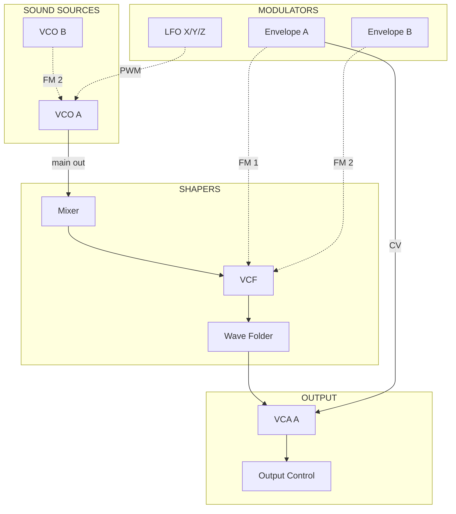

# Phase 8: Cascadia Instrument Data - Research

**Researched:** 2026-03-31
**Domain:** Content authoring, Next.js dynamic routing, Zod schema extension, Mermaid diagrams
**Confidence:** HIGH

## Summary

Phase 8 creates the Cascadia instrument documentation: an overview page, normalled signal path documentation, and per-module reference pages. The work splits into three layers: (1) content authoring from the Cascadia manual v1.1 (110 pages), (2) content infrastructure (new schema type, reader function for `modules/` subdirectory, test fixtures), and (3) UI routes and components (module index page, module detail page, overview page rewrite).

The project's existing patterns are well-established and consistent. The `InstrumentFileSchema` needs its `type` enum extended with a new value for module files (or a new `ModuleFileSchema` created). The content reader needs a `listModules()` function following the `listSessions()`/`listPatches()` pattern. The bundle-content script already recursively copies directories, so the `modules/` subdirectory will be picked up automatically.

**Primary recommendation:** Structure the work as content-first (write all markdown), then infrastructure (schema, reader, fixtures, tests), then UI (routes and components). Content can be validated against the schema once it exists, but writing it first lets you batch the manual extraction work.

<user_constraints>

## User Constraints (from CONTEXT.md)

### Locked Decisions
- One markdown file per hardware module in `instruments/cascadia/modules/` subdirectory (~15 files)
- Top-level `modules.md` serves as index, lists hardware modules in panel order
- Each module gets its own route: `/instruments/cascadia/modules/vcf`
- Content reader needs updates to discover and serve `modules/` subdirectory files
- Separate `signal-flow.md` file with Mermaid diagram using subgraph syntax (sound sources, shapers, modulators, output)
- Mermaid uses solid lines for normalled connections, dashed lines for available patch points
- Per-module template: Purpose, What Makes It Special, Controls table, Patch Points table, LEDs, Normalled Connections
- Extended frontmatter: `category` (sound-source|shaper|modulator|utility), `control_count`, `jack_count`, `has_normals`
- Overview page structure: Identity, Design Philosophy, Panel Layout, Normalling Overview, What You Can Do With It, Make a Sound
- Primary source: `references/cascadia_manual_v1.1.pdf` (accessible at `src/content/references/`)
- Module ordering follows physical panel layout (left to right)

### Claude's Discretion
- Exact Mermaid diagram layout and styling within subgraph constraint
- How to handle simple vs complex modules (e.g., output vs Envelope B triple-mode)
- Content reader implementation approach for discovering `modules/` subdirectory files
- Whether to create a ModuleSchema or extend existing schemas for module frontmatter validation
- Bundling strategy for `src/content/` (mirror `instruments/` structure or flatten)

### Deferred Ideas (OUT OF SCOPE)
None -- discussion stayed within phase scope.

</user_constraints>

<phase_requirements>

## Phase Requirements

| ID | Description | Research Support |
|----|-------------|------------------|
| CASC-01 | Cascadia overview page with architecture description, signal flow, and module layout | Overview page rewrite with new structure; signal-flow.md with Mermaid diagram; links to module index |
| CASC-02 | Normalled signal path documented (what you hear with zero cables patched) | signal-flow.md with Mermaid subgraph diagram (solid=normalled, dashed=patchable); prose explanation of each normal |
| CASC-03 | Each module documented with controls, jacks, normals, and LED behavior | ~15 module files in `modules/` subdirectory using consistent template; new schema, reader function, and UI routes |

</phase_requirements>

## Architecture Patterns

### Cascadia Module Inventory (from manual v1.1 TOC)

The manual documents these hardware modules, in panel order (left to right):

| # | Module | Category | Manual Pages | Complexity |
|---|--------|----------|-------------|------------|
| 1 | MIDI/CV | utility | 17-21 | Medium (MIDI routing, CV outputs) |
| 2 | VCO A | sound-source | 22-25 | High (TZFM, sync, multiple outputs) |
| 3 | VCO B | sound-source | 26-27 | Medium (simpler, LFO-capable) |
| 4 | Envelope A | modulator | 28-33 | Medium (ADSR with Hold stage) |
| 5 | Envelope B | modulator | 34-39 | High (triple-mode: ENV/LFO/Burst) |
| 6 | Line In | utility | 40 | Low (single page) |
| 7 | Mixer | utility | 41-43 | Medium (noise, sub, soft clip) |
| 8 | VCF | shaper | 44-49 | High (multimode, self-oscillating) |
| 9 | Wave Folder | shaper | 50-51 | Medium |
| 10 | VCA A | utility | 52-53 | Low-Medium |
| 11 | Push Gate | utility | 54 | Low (single page) |
| 12 | Utilities (S&H, Slew/Env Follow, Mixuverter) | utility | 55-60 | Medium (3 sub-sections) |
| 13 | LFO X/Y/Z | modulator | 61-62 | Medium (trio with rate dividers) |
| 14 | Patchbay (Mults, Sum, Invert, Bi>Uni, Exp Src, Ringmod) | utility | 63-68 | Medium (6 sub-sections) |
| 15 | VCA B / LPF | shaper | 69-70 | Medium (dual function) |
| 16 | FX Send/Return | utility | 72-73 | Low-Medium |
| 17 | Output Control | utility | 74-75 | Low-Medium |

**Decision point (Claude's discretion):** Modules 12 (Utilities) and 14 (Patchbay) are compound sections in the manual containing 3 and 6 sub-modules respectively. Two approaches:

- **Option A (recommended):** Keep compound modules as single files matching the manual's grouping. The Utilities file covers S&H + Slew/Env Follow + Mixuverter as subsections. The Patchbay file covers Mults + Sum + Invert + Bi>Uni + Exp Src + Ringmod. This gives ~15 files matching the context decision.
- **Option B:** Split every sub-module into its own file (~22 files). More granular but diverges from "~15 files" in the context.

**Recommendation:** Option A. It matches the manual's organization, the physical panel groupings, and the ~15 file count from the context. Individual sub-modules are documented as H2 sections within their parent file. The `control_count` and `jack_count` frontmatter aggregates across sub-sections.

### Module File Template

```markdown
---
type: module
instrument: cascadia
title: "VCF"
manufacturer: "Intellijel"
category: shaper
control_count: 8
jack_count: 12
has_normals: true
---

# VCF

## Purpose

[What this module does in the signal chain]

## What Makes It Special

[Synthesis perspective -- comparisons, unusual features, design philosophy]

## Controls

| Control | Type | Range | Notes |
|---------|------|-------|-------|
| CUTOFF | Knob | 20Hz-20kHz | Main frequency cutoff |

## Patch Points

| Jack | Type | Normalled To | Notes |
|------|------|-------------|-------|
| FM 1 IN | Input | ENV A | Envelope modulation of cutoff |

## LEDs

[LED behavior description]

## Normalled Connections

[Which connections are active by default, what patching overrides them]
```

### Recommended File Structure

```
instruments/cascadia/
  overview.md          # Rewritten with Cascadia-specific structure
  signal-flow.md       # Normalled path Mermaid + prose
  modules.md           # Index listing all hardware modules in panel order
  modules/
    midi-cv.md
    vco-a.md
    vco-b.md
    envelope-a.md
    envelope-b.md
    line-in.md
    mixer.md
    vcf.md
    wave-folder.md
    vca-a.md
    push-gate.md
    utilities.md       # S&H + Slew/Env Follow + Mixuverter
    lfo-xyz.md
    patchbay.md        # Mults + Sum + Invert + Bi>Uni + Exp Src + Ringmod
    vca-b-lpf.md
    fx-send-return.md
    output-control.md
```

Bundled content mirrors this at `src/content/instruments/cascadia/`. The bundle-content script uses `fs.cpSync(src, dest, { recursive: true })` which will copy the `modules/` subdirectory automatically.

### Schema Extension

**Recommendation: Extend `InstrumentFileSchema.type` enum** rather than creating a separate schema.

Current enum: `['overview', 'signal-flow', 'basic-patch', 'modules']`
Extended enum: `['overview', 'signal-flow', 'basic-patch', 'modules', 'module']`

The `module` type (singular) represents individual module files. Extended frontmatter fields (`category`, `control_count`, `jack_count`, `has_normals`) are validated via `.passthrough()` already on InstrumentFileSchema, but adding explicit optional fields provides better type safety:

```typescript
export const InstrumentFileSchema = z.object({
  type: z.enum(['overview', 'signal-flow', 'basic-patch', 'modules', 'module']),
  instrument: z.string(),
  title: z.string(),
  manufacturer: z.string(),
  // Module-specific fields (optional, present when type === 'module')
  category: z.enum(['sound-source', 'shaper', 'modulator', 'utility']).optional(),
  control_count: z.number().int().nonnegative().optional(),
  jack_count: z.number().int().nonnegative().optional(),
  has_normals: z.boolean().optional(),
}).passthrough();
```

This approach keeps a single schema (no new `ModuleSchema`) while adding typed fields for module metadata. The `.passthrough()` remains for future-proofing.

### Content Reader Extension

New function following established pattern:

```typescript
export async function listModules(
  instrument: string,
  config: AppConfig,
): Promise<Array<{ data: InstrumentFile; content: string; slug: string }>> {
  const root = getContentRoot(config);
  const pattern = path.join(root, 'instruments', instrument, 'modules', '*.md');
  const files = await glob(pattern);

  const results = await Promise.all(
    files.map(async (filePath) => {
      const raw = await fs.readFile(filePath, 'utf-8');
      const { data, content } = matter(raw);
      const validated = InstrumentFileSchema.parse(data);
      const slug = path.basename(filePath, '.md');
      return { data: validated, content, slug };
    }),
  );

  return results;
}
```

### New Routes

Two new route files in the Next.js app directory:

```
src/app/instruments/[slug]/modules/
  page.tsx            # Module index (ModuleIndex component)
  [module]/
    page.tsx          # Module detail (ModuleDetail component)
```

These follow the existing `[slug]/sessions/[id]/page.tsx` pattern.

### Anti-Patterns to Avoid

- **Hardcoding Cascadia in routes or components.** All new routes use `[slug]` parameter. Module listing works for any instrument that has a `modules/` subdirectory.
- **Duplicating content between overview.md and signal-flow.md.** The overview links to signal-flow; it does not embed the full diagram.
- **Mixing curriculum order with panel order.** Module index uses panel order. Curriculum ordering is Phase 10's concern.

## Don't Hand-Roll

| Problem | Don't Build | Use Instead | Why |
|---------|-------------|-------------|-----|
| Mermaid rendering | Custom SVG diagram | Existing `MermaidRenderer` component | Already handles dark theme, SSR placeholder, client-side hydration |
| Markdown parsing | Custom parser | Existing `gray-matter` + `rehype` pipeline | Already handles frontmatter, callouts, param tables |
| File discovery | Custom recursive walk | `glob` library (already imported in reader.ts) | Pattern matching already used for sessions and patches |
| Content bundling | Custom copy script for modules/ | Existing `bundle-content.ts` with `fs.cpSync` recursive | Already copies full directory trees |

## Common Pitfalls

### Pitfall 1: InstrumentFileSchema type enum not updated
**What goes wrong:** Module markdown files with `type: module` fail Zod validation at parse time.
**Why it happens:** The existing enum is `['overview', 'signal-flow', 'basic-patch', 'modules']` -- `module` (singular) is not included.
**How to avoid:** Update the enum BEFORE writing content files. Run `npm run test` after schema change to verify existing tests still pass.
**Warning signs:** `ZodError` mentioning invalid enum value for `type` field.

### Pitfall 2: Module files not discovered by existing listInstrumentFiles
**What goes wrong:** `listInstrumentFiles()` uses `glob('instruments/{instrument}/*.md')` which only matches top-level files, not `modules/*.md`.
**Why it happens:** The glob pattern does not recurse into subdirectories.
**How to avoid:** Create a separate `listModules()` function that globs `instruments/{instrument}/modules/*.md`. Do NOT modify `listInstrumentFiles()` -- it should continue to return only top-level files (overview, signal-flow, modules index).
**Warning signs:** Module index page shows no modules despite files existing.

### Pitfall 3: Mermaid diagram too complex for rendering
**What goes wrong:** Signal flow diagram with all ~100+ patch points becomes unreadable.
**Why it happens:** Trying to show every single jack as a node in one diagram.
**How to avoid:** Show normalled connections (the default signal path) as the primary diagram. Patch points are mentioned in prose or per-module docs, not all crammed into one diagram.
**Warning signs:** Mermaid rendering timeout or garbled layout.

### Pitfall 4: Envelope B triple-mode documentation explosion
**What goes wrong:** Envelope B's three modes (Envelope, LFO, Burst Generator) have completely different control behaviors, documented across manual pages 34-39 and detailed pages 82-97.
**Why it happens:** The manual dedicates 20+ pages to Envelope B alone because each mode changes what the controls do.
**How to avoid:** Document all three modes in the envelope-b.md file with clear H2 sections per mode. Use the main Controls table for shared physical controls, then mode-specific subsections explaining how each control behaves differently per mode.
**Warning signs:** Single controls table that only describes one mode's behavior.

### Pitfall 5: Missing test fixtures for modules/ subdirectory
**What goes wrong:** Tests pass with no module data because fixtures don't include a `modules/` subdirectory.
**Why it happens:** Existing test fixtures at `__fixtures__/instruments/cascadia/` only have `instrument.json` and `overview.md`.
**How to avoid:** Add at least 2 fixture module files in `__fixtures__/instruments/cascadia/modules/` to test `listModules()`.
**Warning signs:** Tests for `listModules()` return empty arrays and pass vacuously.

## Normalled Signal Path (from manual analysis)

The default signal path (zero cables patched, MIDI connected) based on manual "DEFAULT ROUTING" entries:

1. **MIDI/CV** -- MIDI note data drives VCO A and VCO B pitch; MIDI velocity normalled to ENV A CTRL input; MIDI gate triggers ENV A and ENV B
2. **VCO A** -- Main oscillator output normalled to Mixer IN
3. **VCO B** -- Output normalled to VCO A FM 2 input (for FM synthesis)
4. **Envelope A** -- ADSR output normalled to VCA A CV input (amplitude envelope) and to VCF FM 1 input
5. **Envelope B** -- Output normalled to VCF FM 2 input (filter modulation)
6. **Mixer** -- Combines VCO A output (+ noise, sub, external) into VCF input
7. **VCF** -- Filter output normalled to Wave Folder input
8. **Wave Folder** -- Output normalled to VCA A IN 1
9. **VCA A** -- Output normalled to Output Control MAIN 1 IN
10. **LFO X/Y/Z** -- LFO X normalled to VCO A Pulse Width; LFO Z normalled to MULT IN 1
11. **Output Control** -- MAIN 1 normalled from VCA A; routes to headphones and rear audio outputs

This forms the Mermaid diagram's solid-line connections.

## Code Examples

### Module frontmatter example (VCO A)

```yaml
---
type: module
instrument: cascadia
title: "VCO A"
manufacturer: "Intellijel"
category: sound-source
control_count: 11
jack_count: 8
has_normals: true
---
```

### Mermaid signal flow pattern (subgraph approach)



### Content reader listModules function

```typescript
// Source: follows listSessions/listPatches pattern in src/lib/content/reader.ts
export async function listModules(
  instrument: string,
  config: AppConfig,
): Promise<Array<{ data: InstrumentFile; content: string; slug: string }>> {
  const root = getContentRoot(config);
  const pattern = path.join(root, 'instruments', instrument, 'modules', '*.md');
  const files = await glob(pattern);

  const results = await Promise.all(
    files.map(async (filePath) => {
      const raw = await fs.readFile(filePath, 'utf-8');
      const { data, content } = matter(raw);
      const validated = InstrumentFileSchema.parse(data);
      const slug = path.basename(filePath, '.md');
      return { data: validated, content, slug };
    }),
  );

  return results;
}
```

## Validation Architecture

### Test Framework

| Property | Value |
|----------|-------|
| Framework | vitest (via package.json) |
| Config file | `vitest.config.ts` |
| Quick run command | `npx vitest run --reporter=verbose` |
| Full suite command | `npx vitest run` |

### Phase Requirements -> Test Map

| Req ID | Behavior | Test Type | Automated Command | File Exists? |
|--------|----------|-----------|-------------------|-------------|
| CASC-01 | Overview page renders with architecture, signal flow link, module link | integration | `npx vitest run src/lib/content/__tests__/reader.test.ts -t "listInstrumentFiles"` | Partial (existing reader tests cover listInstrumentFiles but not Cascadia overview content) |
| CASC-02 | Signal flow file parseable with valid frontmatter | unit | `npx vitest run src/lib/content/__tests__/schemas.test.ts` | Partial (schema tests exist but no signal-flow specific Cascadia test) |
| CASC-03 | listModules returns all module files with valid schema | unit | `npx vitest run src/lib/content/__tests__/reader.test.ts -t "listModules"` | No -- Wave 0 |

### Sampling Rate
- **Per task commit:** `npx vitest run --reporter=verbose`
- **Per wave merge:** `npx vitest run`
- **Phase gate:** Full suite green before `/gsd:verify-work`

### Wave 0 Gaps
- [ ] `src/lib/content/__tests__/__fixtures__/instruments/cascadia/modules/` -- needs 2+ fixture module files
- [ ] `src/lib/content/__tests__/reader.test.ts` -- needs `listModules` test cases
- [ ] `src/lib/content/__tests__/schemas.test.ts` -- needs tests for `type: 'module'` enum and optional module fields

## Project Constraints (from CLAUDE.md)

- **File naming:** kebab-case throughout (applies to all module filenames)
- **Instruments:** Each instrument lives in `instruments/<name>/`
- **Session length:** 15-30 min, not directly relevant to this phase but "Make a Sound" in overview should be a quick-start, not a full session
- **Undocumented patches are lost patches:** Module documentation must be thorough enough to be usable as reference
- **Obsidian vault integration:** Content must work both from vault path and bundled `src/content/`

## Sources

### Primary (HIGH confidence)
- `src/content/references/cascadia_manual_v1.1.pdf` -- Table of contents, module inventory, normalled connections, control/jack listings
- `src/lib/content/reader.ts` -- Existing reader patterns (listSessions, listPatches, listInstrumentFiles)
- `src/lib/content/schemas.ts` -- Current InstrumentFileSchema with type enum and passthrough
- `src/app/instruments/[slug]/page.tsx` -- Current instrument overview page implementation
- `src/components/instrument-overview.tsx` -- Current InstrumentOverview component props and layout

### Secondary (MEDIUM confidence)
- `08-UI-SPEC.md` -- UI design contract for component specs, spacing, typography
- `08-CONTEXT.md` -- User decisions constraining implementation approach
- `instruments/evolver/overview.md`, `signal-flow.md` -- Reference patterns for content structure

## Metadata

**Confidence breakdown:**
- Standard stack: HIGH -- no new libraries needed, all tools already in the project
- Architecture: HIGH -- patterns established in Phase 1-7 directly apply; extensions are incremental
- Pitfalls: HIGH -- based on direct code inspection of schemas, reader, and fixtures
- Content accuracy: MEDIUM -- normalled signal path extracted from manual text search, should be verified against manual diagrams during content authoring

**Research date:** 2026-03-31
**Valid until:** 2026-04-30 (stable -- no dependency changes expected)
