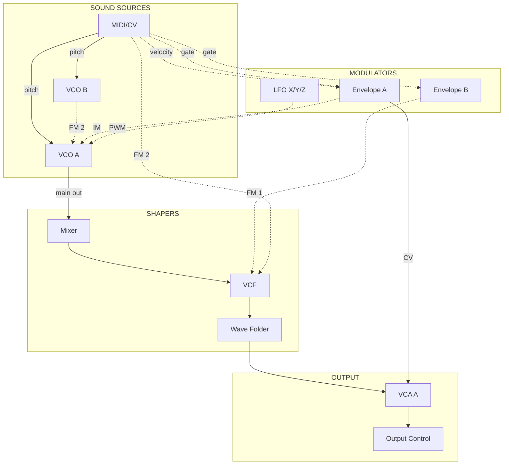

# Cascadia Signal Flow

With no cables patched, the Cascadia produces sound through these normalled connections:

**Diagram key:** Solid arrows (`-->`) show the primary audio signal path from oscillator to output. Dashed arrows (`-.->`) show modulation normalling and secondary connections that shape the sound but are not part of the main audio chain.

## What Each Connection Does

### Primary Audio Path (solid lines)

1. **MIDI/CV -> VCO A pitch**: MIDI note data sets the pitch of VCO A via 1V/octave CV. This is the main pitch source for the instrument.

2. **MIDI/CV -> VCO B pitch**: MIDI pitch is also normalled to VCO B (when its PITCH SOURCE switch is set to PITCH A+B), keeping both oscillators in tune.

3. **VCO A -> Mixer**: VCO A's waveform outputs (saw, pulse, triangle) feed the Mixer, where they are blended with noise, sub-oscillator, and external inputs.

4. **Mixer -> VCF**: The mixed signal enters the voltage-controlled filter for spectral shaping. Patching into VCF IN overrides this connection.

5. **VCF -> Wave Folder**: The filtered signal passes through the wave folder. Even with folding at minimum, the signal passes through to VCA A.

6. **Wave Folder -> VCA A**: The wave folder output is normalled to VCA A's input, completing the audio chain before the output stage.

7. **VCA A -> Output Control**: VCA A's output is normalled to the MAIN 1 input on Output Control, which drives the headphone and line outputs.

### Modulation Normalling (dashed lines)

8. **Envelope A -> VCA A (CV)**: Envelope A's output controls VCA A's amplitude. This is the amplitude envelope -- it shapes every note's volume over time (attack, decay, sustain, release). Patching into VCA A's LEVEL MOD IN overrides this.

9. **Envelope A -> VCO A (IM)**: Envelope A is normalled to VCO A's Index Modulation input, allowing the envelope to control FM depth. The IM MOD slider sets how much this affects FM 2 intensity.

10. **Envelope B -> VCF (FM 1)**: Envelope B modulates the filter cutoff frequency via FM 1. This creates the classic "envelope-controlled filter sweep" heard in plucky and percussive sounds. Patching into VCF FM 1 IN overrides this.

11. **MIDI/CV -> VCF (FM 2)**: MIDI pitch is normalled to VCF FM 2, providing keyboard tracking for the filter. This keeps the filter cutoff proportional to the note being played, essential when the filter is self-oscillating.

12. **MIDI/CV -> Envelope A (velocity)**: MIDI velocity is normalled to Envelope A's CTRL input. Depending on the CTRL SOURCE switch, this scales either the envelope's amplitude or its overall time -- softer notes play quieter or slower.

13. **MIDI/CV -> Envelope A (gate)**: MIDI gate triggers Envelope A. The gate going high starts the attack stage; the gate going low triggers the release stage.

14. **MIDI/CV -> Envelope B (gate)**: MIDI gate also triggers Envelope B, so both envelopes respond to the same note events by default.

15. **VCO B -> VCO A (FM 2)**: VCO B's sine wave output is normalled to VCO A's FM 2 input. This enables frequency modulation synthesis with zero cables -- use VCO A's INDEX slider to dial in FM depth.

16. **LFO X/Y -> VCO A (PWM)**: LFO Y is normalled to VCO A's pulse width modulation input. Raising the PW MOD slider adds movement to the pulse wave output. LFO Z is normalled to MULT IN 1 in the Patchbay for distribution.
