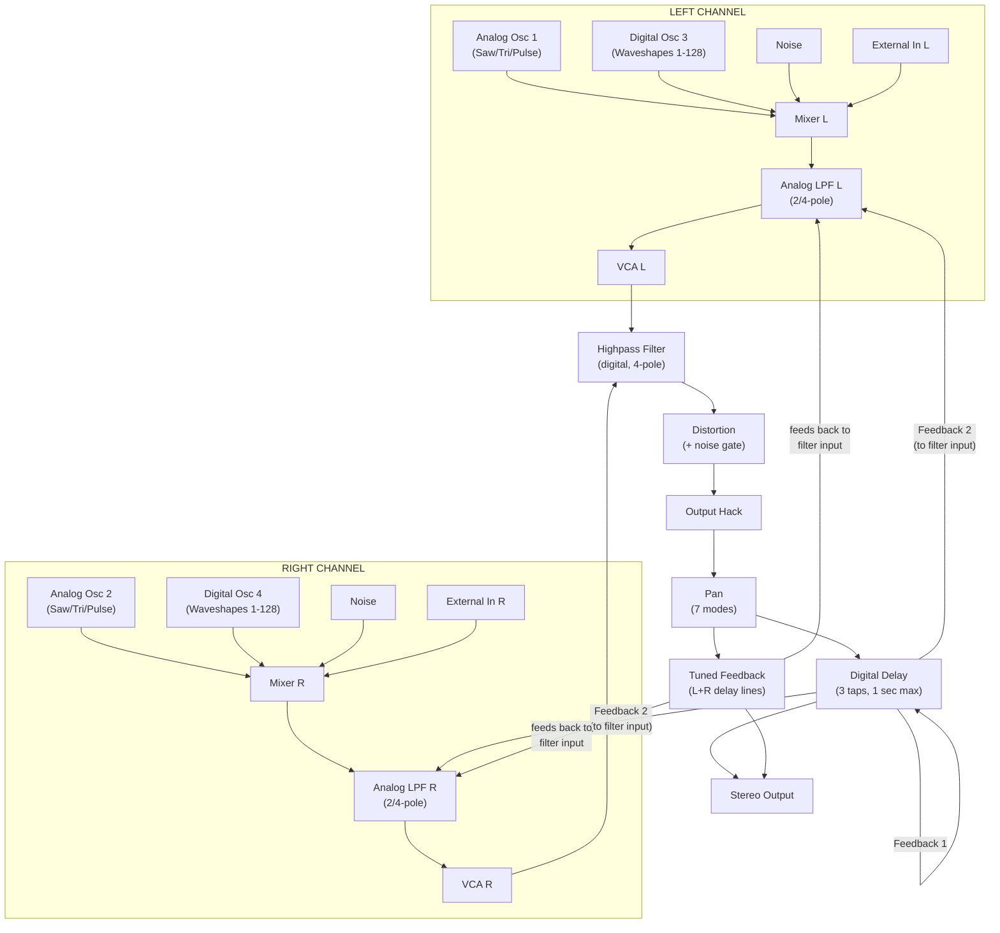

# Evolver Signal Flow

## Signal Flow Diagram (Mermaid)



## Audio Path (Text Diagram)

```
                    +---------------+
                    |  EXTERNAL     |
                    |   INPUTS      |
                    |  (L + R)      |
                    +-------+-------+
                            |
              +-------------+-------------+
              |                           |
              v                           v
    +--- LEFT CHANNEL ---+    +-- RIGHT CHANNEL --+
    |                     |    |                    |
    |  Analog Osc 1       |    |  Analog Osc 2      |
    |  Digital Osc 3      |    |  Digital Osc 4      |
    |  Noise              |    |  Noise              |
    |  External In L      |    |  External In R      |
    |         |           |    |         |           |
    |         v           |    |         v           |
    |  +-----------+      |    |  +-----------+      |
    |  | ANALOG LPF|      |    |  | ANALOG LPF|      |
    |  | (2/4 pole) |      |    |  | (2/4 pole) |      |
    |  | +resonance |      |    |  | +resonance |      |
    |  +-----+-----+      |    |  +-----+-----+      |
    |        |             |    |        |             |
    |        v             |    |        v             |
    |  +-----------+       |    |  +-----------+       |
    |  |    VCA    |       |    |  |    VCA    |       |
    |  +-----+-----+       |    |  +-----+-----+       |
    |        |             |    |        |             |
    +--------+-------------+    +--------+-------------+
             |                           |
             +-----------+---------------+
                         |
                  +------v------+
                  |  HIGHPASS   |
                  |  FILTER    |
                  |  (digital)  |
                  +------+------+
                         |
                  +------v------+
                  | DISTORTION  |
                  | (+ noise    |
                  |   gate)     |
                  +------+------+
                         |
                  +------v------+
                  |   OUTPUT    |
                  |    HACK    |
                  +------+------+
                         |
                  +------v------+
                  |    PAN     |
                  +------+------+
                         |
             +-----------+----------+
             |                      |
             v                      v
       +----------+          +----------+
       |  DELAY   |          | TUNED    |
       | (3 taps, |<--FB1--> | FEEDBACK |
       |  1 sec)  |          | (L + R   |
       +----+-----+          |  delay   |
            |                |  lines)  |
            |      FB2       +----+-----+
            +--- (to filter) ---->|
            |                     | (feeds back to filter input)
            v                     v
      +----------+          +----------+
      |  STEREO  |<-------->|  STEREO  |
      |  OUTPUT  |          |  OUTPUT  |
      +----------+          +----------+
```

## Pre/Post Routing Options

Both **Distortion** and **Highpass Filter** can be switched between two positions in the signal chain. This dramatically changes their sonic role:

| Component | Pre (After ExtIn) | Post (After VCA) |
|-----------|-------------------|-------------------|
| Highpass | Before analog LPF, only affects external input | After VCA, before delay -- filters everything |
| Distortion | Before analog LPF, only affects external input | After VCA+HPF, before delay -- distorts everything |

Source: DSI Manual p.26

## Oscillator Routing (Fixed)

The oscillator-to-channel assignments are hardwired:

| Component | Channel | Notes |
|-----------|---------|-------|
| Analog Osc 1 | Left | Saw, Triangle, Saw-Tri, Pulse (variable width) |
| Analog Osc 2 | Right | Saw, Triangle, Saw-Tri, Pulse (variable width) |
| Digital Osc 3 | Left | 128 waveshapes (Prophet-VS lineage), FM from Osc 4, Ring Mod from Osc 4 |
| Digital Osc 4 | Right | 128 waveshapes, FM from Osc 3, Ring Mod from Osc 3 |
| Noise | Both | Single noise source mixed equally into both L and R filter inputs |
| External In | L/R or Mono | Configurable: Stereo, Mono Left, Mono Right, L Control + R Audio |

Source: DSI Manual p.7-8, p.15-16

## Modulation Sources

| Source | Notes |
|--------|-------|
| ENV 1 | Filter envelope (dedicated to LPF cutoff) |
| ENV 2 | VCA envelope (dedicated to amplitude) |
| ENV 3 | Mod envelope (freely assignable, has delay parameter) |
| LFO 1-4 | Each with: shape, freq, amount, destination, key sync |
| Sequencer 1-4 | 16 steps each, any parameter destination |
| Mod Slots 1-4 | Source --> Amount --> Destination routing (unfiltered, fast response) |
| Velocity | Per-envelope velocity sensitivity + assignable destination |
| Aftertouch/Pressure | Amount --> destination (filtered/smoothed via Misc Params) |
| Mod Wheel | Amount --> destination (filtered/smoothed via Misc Params) |
| Breath | Amount --> destination |
| Foot Controller | Amount --> destination |
| Pitch Bend | +/- range in semitones (0-12) |
| Envelope Follower | Tracks left external input level -- useful for sidechain effects |
| Peak Hold | Detects left external input peaks -- useful for triggering |

Source: DSI Manual p.21-23, p.33-35

## Key Signal Flow Insights

1. **Stereo is fundamental** -- L/R paths are independent through the analog section. Use Output Pan and Filter Split to exploit this.
2. **Feedback creates new timbres** -- The tuned feedback loop can act as a physical model (Karplus-Strong) or add resonant character. Frequency range is C0-C4 (4 octaves).
3. **Delay FB2 --> Filter** -- This secondary feedback path routes delay output back to the analog filter input, enabling extreme effects and complex resonant structures.
4. **Pre/Post switching** -- Distortion and HPF positioning dramatically changes character. Pre = only external input affected; Post = entire signal chain affected.
5. **Noise feeds both channels** -- Single noise source, mixed equally into L and R filter inputs.
6. **Audio mod is per-channel** -- Osc 1 modulates LPF L, Osc 2 modulates LPF R. This preserves the stereo character even during audio-rate modulation.
7. **Digital oscillators cross-modulate** -- FM and Ring Mod are bidirectional between Osc 3 and Osc 4, and both can be active simultaneously for wild results.

Source: DSI Manual p.7-8, Anu Kirk Guide overview section
